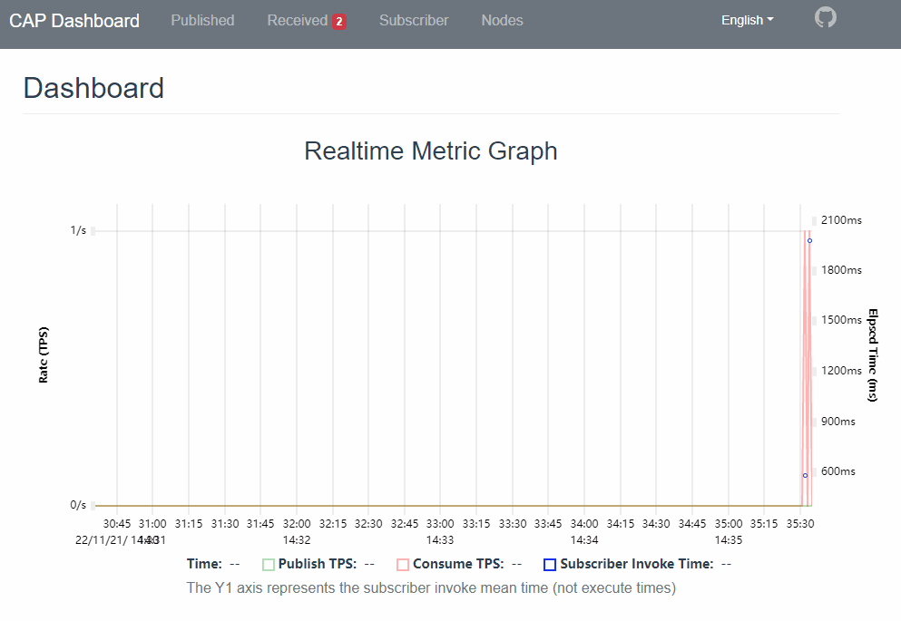

# Diagnostics

Diagnostics provides a set of features that make it easy to document critical operations that occur during application execution, their execution time, etc., allowing administrators to find the root cause of problems, especially in production environments.

## Tracing

CAP provides support for `DiagnosticSource` with a listener name of `CapDiagnosticListener`.

Diagnostics provides the following tracing event information:

* Before the message is persisted
* After the message is persisted
* Message persistence exception
* Before the message is sent to the message queue
* After the message is sent to the message queue
* Message sending exception to the message queue
* Messages saved from message queue consumption before persistence
* After messages are saved from message queue consumption
* Before the subscriber method is executed
* After the subscriber method is executed
* Subscriber method execution exception

Related objects can be found in the `DotNetCore.CAP.Diagnostics` namespace.

### Tracing with Apache Skywalking

Skywalking's C# client provides support for CAP Diagnostics. You can use [SkyAPM-dotnet](https://github.com/SkyAPM/SkyAPM-dotnet) for tracking.

Read the [README](https://github.com/SkyAPM/SkyAPM-dotnet/blob/master/README.md) to integrate it into your project.

Example tracking images:


### Other APM Support

Currently, we only support Skywalking. If you want to support CAP diagnostic events in other APMs, you can refer to the code [here](https://github.com/SkyAPM/SkyAPM-dotnet/tree/master/src/SkyApm.Diagnostics.CAP) for implementation. We also welcome Pull Requests.

## Metrics

Metrics are numerical measurements reported over time. They are typically used to monitor application health and generate alerts. For example, a web service might track the number of requests it receives each second, how many milliseconds it takes to respond, and how many responses return an error to the user.

CAP 7.0 is support for `EventSource`, and the counters name is `DotNetCore.CAP.EventCounter`.

CAP provides the following metrics:

* Publish rate pre seconds
* Consume rate pre seconds
* Invoke Subscriber rate pre seconds
* Subscriber elpased time mean pre seconds 

### Monitor with dotnet-counters

[dotnet-counters](https://learn.microsoft.com/zh-cn/dotnet/core/diagnostics/dotnet-counters) is a performance monitoring tool for ad-hoc health monitoring and first-level performance investigation. It can observe performance counter values that are published via the EventCounter API or the Meter API. 

Use the following commands to monitor metrics in CAP:

```ps
dotnet-counters ps
dotnet-counters monitor --process-id=25496 --counters=DotNetCore.CAP.EventCounter
```

process-id： The ID of the CAP process to collect counter data from.


### Monitor with dashboard

You can configure `x.UseDashboard()` to open the dashboard to view Metrics graph charts.



In the Realtime Metric Graph, the time axis will scroll in real time over time so that you can see the rate of publishing and consuming messages per second, And the consumer execution time is "dotted" on the Y1 axis (Y0 axis is the rates, and the Y1 axis is the execution elpsed time).
 

