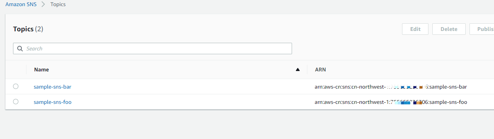

# Amazon SQS

AWS SQS is a fully managed message queuing service that enables you to decouple and scale microservices, distributed systems, and serverless applications.

AWS SNS is a highly available, durable, secure, fully managed pub/sub messaging service that enables you to decouple microservices, distributed systems, and serverless applications.

## How CAP Uses AWS SNS and SQS

### SNS

Because CAP works based on the topic pattern, it requires AWS SNS, which simplifies the publish-subscribe architecture for messaging.

When CAP starts, all subscription names are registered as SNS topics. You will see a list of all registered topics in the AWS management console.

SNS does not support certain characters such as `.`, `:` in topic names, so CAP replaces them. It replaces `.` with `-` and `:` with `_`.

!!! note "Precautions"
    Amazon SNS currently limits published messages to a maximum size of 256 KB.

For example, you have the following two subscriber methods in your current project

```C#
[CapSubscribe("sample.sns.foo")]
public void TestFoo(DateTime value)
{
}

[CapSubscribe("sample.sns.bar")]
public void TestBar(DateTime value)
{
}
```
After CAP startups, you will see in SNS management console:



### SQS

For each consumer group, CAP will create a corresponding SQS queue. The queue name is the value of `DefaultGroup` in the configuration options, and the queue type is Standard.

The SQS queue will subscribe to the SNS topic as shown below:


!!! warning "Precautions"
    Due to AWS SNS limitations, when you remove a subscription method, CAP will not automatically delete the topics or queues in AWS SNS or SQS. You need to delete them manually.


## Configuration

To use AWS SQS as a transporter, you need to install the following package from NuGet:

```shell

Install-Package DotNetCore.CAP.AmazonSQS

```

Next, add configuration items to the `ConfigureServices` method of `Startup.cs`:

```csharp

public void ConfigureServices(IServiceCollection services)
{
    // ...

    services.AddCap(x =>
    {
        x.UseAmazonSQS(opt=>
        {
            //AmazonSQSOptions
        });
        // x.UseXXX ...
    });
}

```

#### AmazonSQS Options

The SQS configuration parameters provided directly by the CAP:

NAME | DESCRIPTION | TYPE | DEFAULT
:---|:---|---|:---
Region | AWS Region | Amazon.RegionEndpoint | 
Credentials | AWS AK SK Information | Amazon.Runtime.AWSCredentials | 

If your application runs on AWS EC2, you don't need to set credentials. Instead, you can directly apply an IAM policy to the EC2 instance.

Credentials require SNS and SQS IAM permissions.